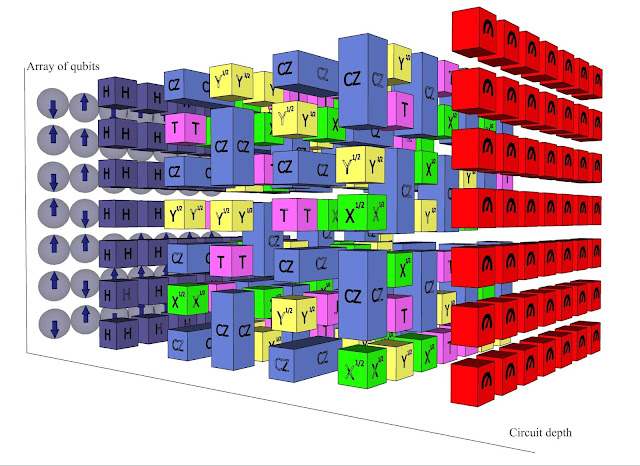
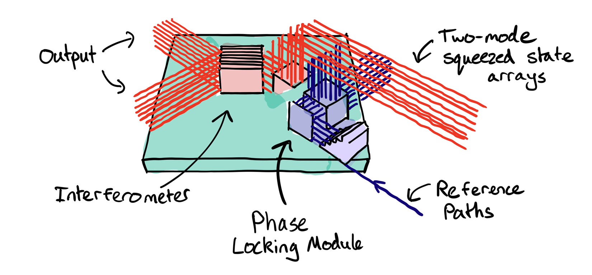
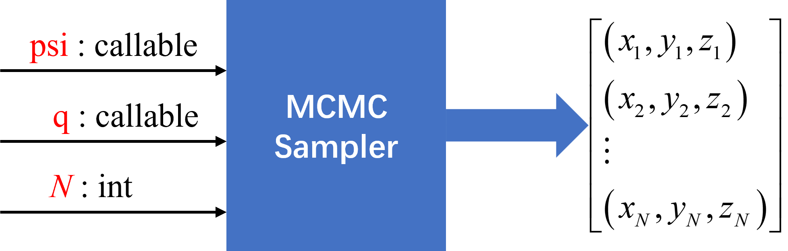
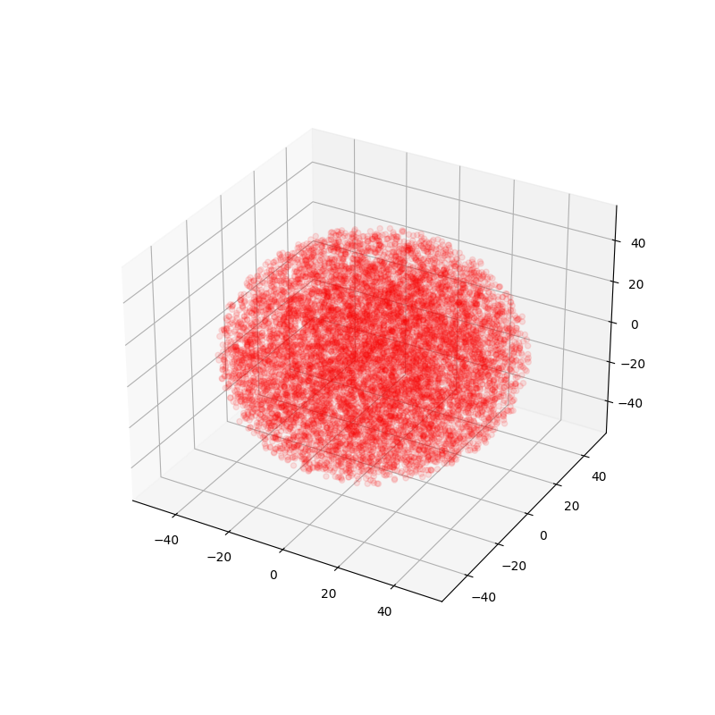
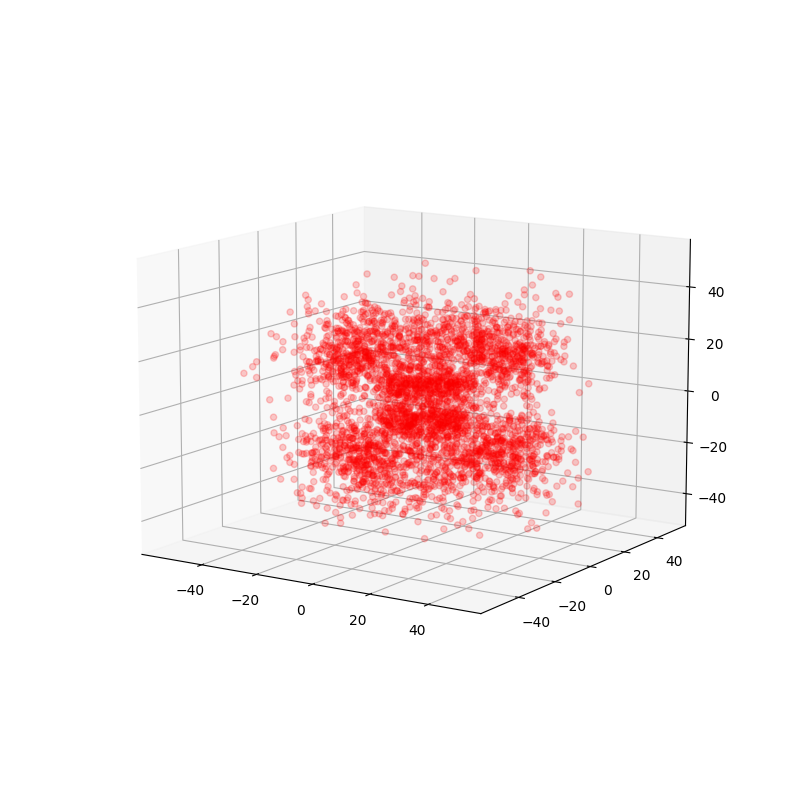

# Taichi Hackathon 2022 项目设计

## 团队名：
民以观音土为天
## 项目名：
《马尔科夫链蒙特卡洛法对氢原子波函数采样生成电子云图像》
## 项目介绍：
&emsp;&emsp;目前在量子计算领域，宣布实现量子霸权的应用有两个：
1. 谷歌的“悬铃木”超导量子计算机，执行随机线路采样(Random Circuit Sampling)算法，完成53量子比特20层循环的幺正操作，可在200秒内执行随机电路的采样任务，从而获得百万个近似末态（含噪声）的比特串采样。谷歌预估在当时全球最快的超级计算机“富悦”上执行同样任务需要1万年。
2. 中科大的“九章”光量子计算机，执行高斯-玻色采样(Gaussian Boson Sampling)算法。“九章”完成5000万个高斯玻色取样需要200秒，而当时最快的超级计算机“富悦”要完成这个过程需要6亿年。
 
可以看出，目前声称的具有量子优势的量子计算机，都出现在解决采样问题上。量子计算机因叠加态的并行计算特性而闻名，但为特定问题设计的硬件更像是一种类比计算(analog computation)，这样的加速效果是否能说明量子计算超越了经典计算机？这是值得怀疑的，毕竟硬件计算 $\ne$ 硬件加速计算，而且经典的蒙特卡罗采样算法也有很多可以改进加速的地方。如果能利用Taichi高性能并行计算语言，可能设计出更高效的经典采样算法，探索经典计算与量子计算的边界。  
&emsp;&emsp;由于对Taichi语言的接触时间较短，熟练度不足，本次hackathon只尝试实现一个简单的波函数蒙特卡洛采样demo。

## 类氢原子波函数
&emsp;&emsp;对于高维参数的样本点进行采样，普通的接受-拒绝采样法效率是很低的。而类氢原子的电子云分布就是一个由空间波函数决定的三维参数抽样点。  

$$\begin{aligned} (r, \theta, \phi) &\sim \mathcal{J} \vert {\Psi_{nlm}} \vert ^2 \\ 
\mathcal{J} &= r^2\sin{\theta} \end{aligned}$$  

三维波函数
&emsp;&emsp;MCMC是一种自适应建议分布的重要性采样过程，建议分布在每抽样出一个点后都会自适应改变，每一步的接受与拒绝都会影响下一步的采样  

马尔科夫链达到稳态分布即是目标分布。
  

&emsp;&emsp;MCMC算法的部署设计  

&emsp;&emsp;由于马尔科夫链的状态转移过程是串行的，如何对MCMC采样过程进行加速是一个重要问题。有一种显而易见的近似并行方法，那就是同时执行多条链。 
&emsp;&emsp;与一条总长度为 $M*N$ 的马尔科夫链 $[x_1,x_2,\dots,x_{MN}]$ 相比，只有单条链里抽样出的点 $[x_1^m,x_2^m,\dots,x_N^m]$ 是有相关性的，并行的链之间的相关性不高，可以用Pearson相关系数来定量分析。

## Uniform Sampling in Ball
&emsp;&emsp;在球坐标系下进行随机游走，需要生成半径为$a$的圆球内的均匀采样。首选，找到参数 $r,\theta,\phi$ 的累积分布函数 $$\begin{cases} cdf(r)&=\frac{r^3}{a^3} \\ cdf(\theta)&=\frac{1-\cos{\theta}}{2} \\ cdf(\phi)&=\frac{\phi}{2 \pi}\end{cases}$$  

然后，生成三个均匀分布 $\xi_1,\xi_2,\xi_3  \sim  U(0,1)$ 带入累积分布函数的反函数就得到参数 $r,\theta,\phi$ 的抽样结果
$$\begin{cases}
r=a\sqrt[3]{\xi_1} \in [0,a)  \\
\theta=\arccos{(1-2\xi_2)} \in [0,\pi) \\
\phi=2\pi\xi_3 \in [0,2\pi)
\end{cases}$$ 

最后还原到直角坐标得到抽样点
$$\begin{cases}
x=2a\sqrt[3]{\xi_1}  \cdot \sqrt{\xi_2(1-\xi_2)}  \cdot \cos{(2\pi\xi_3)} \\
y=2a\sqrt[3]{\xi_1}  \cdot \sqrt{\xi_2(1-\xi_2)}  \cdot \sin{(2\pi\xi_3)} \\
z=2a\sqrt[3]{\xi_1} (1-2\xi_2)
\end{cases}$$  
效果如下

## Pytorch框架下的电子云采样效果

